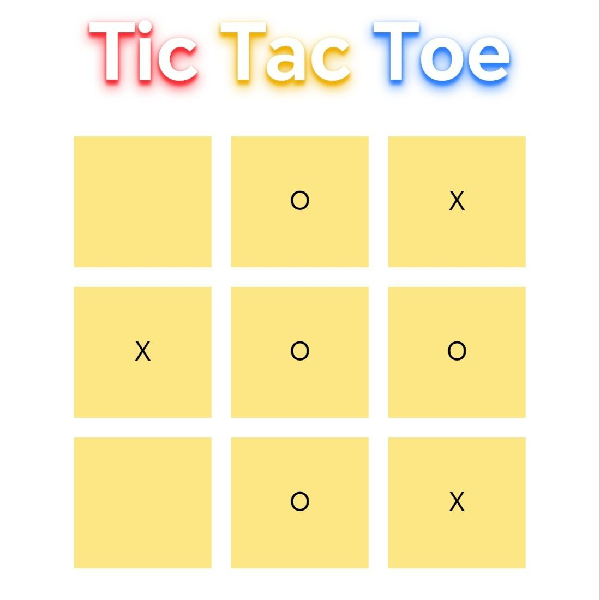

<!-- markdownlint-disable MD033 -->
<h1>Tic Tac Toe</h1>
 <h4>I just try to learn Vue.js, I have no idea, how to learn and what to build, I knew we cannot learn by watching or reading for hours we need take time to hand on with it. Now I just try make this Tic Tac Toe.I think no one know anything without learning, and learn is take sometime.</h4>

 

<!-- markdownlint-enable MD033 -->
# Vue 3 + Vite

This template should help get you started developing with Vue 3 in Vite. The template uses Vue 3 `<script setup>` SFCs, check out the [script setup docs](https://v3.vuejs.org/api/sfc-script-setup.html#sfc-script-setup) to learn more.

Learn more about IDE Support for Vue in the [Vue Docs Scaling up Guide](https://vuejs.org/guide/scaling-up/tooling.html#ide-support).
